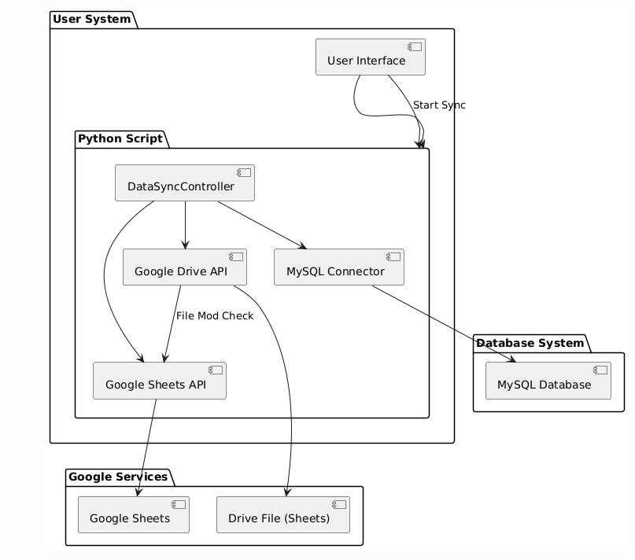
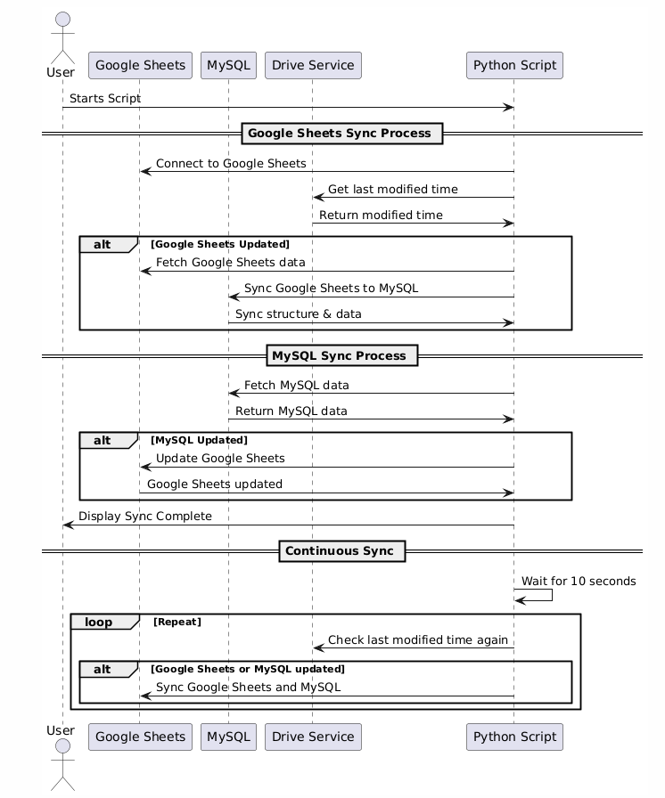

# Bidirectional Sheets2SQL Tool

### Objective
Build a solution that enables real-time synchronization of data between a Google Sheet and a specified database (e.g., MySQL, PostgreSQL). The solution should detect changes in the Google Sheet and update the database accordingly, and vice versa.

### Problem Statement
Many businesses use Google Sheets for collaborative data management and databases for more robust and scalable data storage. However, keeping the data synchronised between Google Sheets and databases is often a manual and error-prone process.

### Requirements:
1. Real-time Synchronisation
  - Implement a system that detects changes in Google Sheets and updates the database accordingly.
   - Similarly, detect changes in the database and update the Google Sheet.
2.	CRUD Operations
   - Ensure the system supports Create, Read, Update, and Delete operations for both Google Sheets and the database.
   - Maintain data consistency across both platforms.
3. Conflict Handling
- Develop a strategy to handle conflicts that may arise when changes are made simultaneously in both Google Sheets and the database.
- Provide options for conflict resolution (e.g., last write wins, user-defined rules).


## About Bidirectional Sheets2SQL Tool 

This project provides a tool for bidirectional synchronization between Google Sheets and MySQL. It ensures that data in Google Sheets and MySQL stays consistent, handling various edge cases, schema changes, and optimizations for performance.

### Features

- **Dynamic Table Handling**: Tables in MySQL are created dynamically based on Google Sheets data. Schema changes like adding/removing rows, columns, and cells are automatically synced.
- **Blank Column Name Handling**: If a column in Google Sheets has no name, a default name (`blank_col_uuid`) is generated to ensure no empty columns exist in the database.
- **Unique Column Name Enforcement**: Duplicate column names are not allowed. If a column name is repeated, a unique UUID is appended to avoid conflicts.
- **Efficient Data Sync**: Instead of re-reading and updating the entire database, only changed rows are updated by utilizing IDs. This improves performance and ensures that no unnecessary updates occur.
- **Row and Column Stability**: Rows and columns remain in the same order even when changes are made, preventing accidental shuffling.
- **Bi-directional Sync**: Syncs both from Google Sheets to MySQL and vice versa, ensuring consistency across both platforms.
- **Column Name Stability**: When modifying column names in Google Sheets, the corresponding columns in MySQL are updated without changing their position in the table.
- **Sync Priority with Checksum**: Changes in Google Sheets are given priority over the SQL database when both have been modified. A checksum is used to detect changes, ensuring efficient syncing.
- **Modified Time Check**: The system fetches Google Sheets data only when there are modifications, reducing unnecessary reads.

### Architecture Overview



*Figure 1: Component Diagram*



*Figure 2: Sequence Diagram*

### How It Works

#### Google Sheets to MySQL Sync:

- On detecting a change in Google Sheets (by comparing the last modified time), the script syncs the data from Google Sheets to MySQL.
- New columns in Google Sheets are added to the MySQL table, while missing columns in Google Sheets are dropped from the MySQL table.
- If any column names are blank, they are replaced with `blank_col_uuid`. Duplicate column names are resolved by appending a UUID.

#### MySQL to Google Sheets Sync:

- If there is a change in the MySQL database (detected via checksum comparison), the script syncs the updated rows back to Google Sheets.
- The tool only updates changed rows and ensures that the structure of both the MySQL table and Google Sheets remains consistent.

### Requirements

- Python 3.x
- MySQL database
- Google Sheets API credentials (store them in `credentials.json`)
- Required Python packages:
  - `gspread`
  - `google-auth`
  - `google-auth-oauthlib`
  - `google-auth-httplib2`
  - `googleapiclient`
  - `mysql-connector-python`

Install the required Python packages using:

```bash
pip install gspread google-auth google-auth-oauthlib google-auth-httplib2 googleapiclient mysql-connector-python
```

#### Configuration

Google Sheets API:
- Enable the Google Sheets and Drive APIs for your project in the Google Developer Console.
- Download the credentials and save them as credentials.json in the project folder.
MySQL:
- Ensure that your MySQL server is running and accessible. The script will create and manage tables dynamically.

### Key Functions

1. **`connect_google_sheets(sheet_id)`**:Authenticates and connects to a Google Sheet using the provided `sheet_id`, returning the first sheet of the workbook.

2. **`get_drive_service()`**: Authenticates and connects to Google Drive using service account credentials to access revision and file metadata.

3. **`get_last_modified_time(fileId, drive)`**: Retrieves the last modified time of the Google Sheet by fetching its revisions from Google Drive.

4. **`fetch_google_sheet_data(sheet)`**: Fetches all data from the connected Google Sheet as a 2D list (all rows and columns).

5. **`connect_mysql()`**: Establishes a connection to a MySQL database with hardcoded credentials and returns the connection object.

6. **`get_mysql_columns(sheet_name)`**: Fetches and returns the column names of the MySQL table corresponding to the Google Sheet.

7. **`sync_table_structure(sheet_name, google_columns)`**: Syncs the MySQL table's structure with Google Sheets by adding or removing columns based on the Google Sheet’s headers.

8. **`create_mysql_table(sheet_name, columns)`**: Creates a MySQL table with the specified columns if it doesn't already exist. Uses `row_number` as the primary key.

9. **`sync_sheet_to_db(sheet_name, google_sheet_data)`**: Syncs the Google Sheet data to the MySQL database. Inserts or updates rows based on the `row_number`.

10. **`fetch_mysql_data(sheet_name)`**: Fetches data from the MySQL table corresponding to the Google Sheet, excluding the `row_number` column.

11. **`update_google_sheets(sheet, new_data, existing_data)`**: Updates the Google Sheet by comparing and updating only the changed cells or rows, minimizing unnecessary writes.

12. **`sync_db_to_google_sheets(sheet, sheet_name, google_sheet_data)`**: Syncs the data from MySQL back to the Google Sheet by updating the Google Sheet with any changes in MySQL.

13. **`generate_unique_column_name(name, existing_names)`**: Generates a unique column name by appending a UUID to avoid duplication in case of duplicate column names.

14. **`sync_google_sheets_to_mysql(sheet, sheet_name, google_sheet_data)`**: Syncs the Google Sheet to MySQL by ensuring column name uniqueness, updating table structure, and syncing data.

15. **`compute_checksum(data)`**: Computes an MD5 checksum of the provided data to detect changes and minimize unnecessary syncing.


